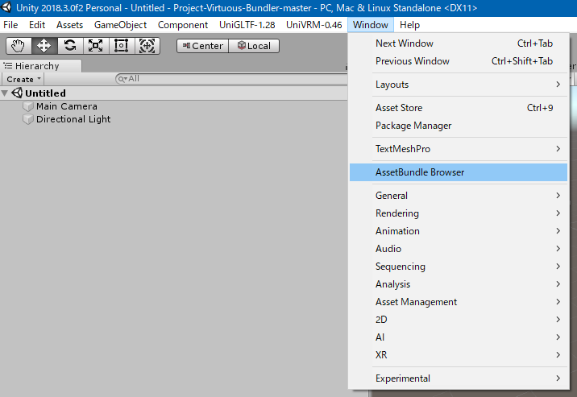
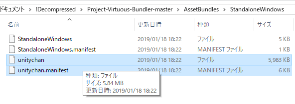
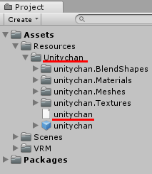

# プレイヤーモデルの仕様

Project-Virtuousではプレイヤーモデルを変更できます。

## 1. 利用できるモデルの形式

利用できるモデルは[VRM形式](https://dwango.github.io/vrm/)のみです。事前に `*.vrm` 形式のファイルを用意してください。

第三者のモデルを利用する場合は必ずライセンスを確認してください。

## 2. VRMモデルを使うための準備

### 2.1. VRMモデルのAssetBundle化

1. まず[Project-Virtuous-Bundler](https://github.com/tkhp/Project-Virtuous-Bundler)にアクセスし、ページ右の `Clone or download` > `Download ZIP` をクリックして `Project-Virtuous-Bundler` をダウンロードしてください。
1. ダウンロードしたzipを解凍し、そのフォルダーをUnityで開いてください。
    - 必ず `Unity 2018.3.0f2` で開くようにしてください。
1. Unityのメニューから `Window` > `AssetBundle Browser` を選択してください。
    
1. `Project` ウィンドウから `Assets/Resources` フォルダーを作成してください。
1. `Assets/Resources` フォルダー中に追加したいVRMと同名のフォルダーを作成してください。
    - ここでは例として `Unitychan` フォルダーを作成します。
1. 作成したフォルダーの中に `*.vrm` 形式のファイルを入れます。
    - 読み込みと変換が始まるのでしばらく待機してください。
    - （もしモデルに対してボーン・アニメーションの調節やコンポーネントの追加などの操作を行いたい場合、読み込み完了後に次のステップに進む前のこの段階で行ってください。）
1. 読み込みが終わったら `AssetBundles` ウィンドウで `Configure` を選択し、その中に先ほど作成した `Assets/Resources/Unitychan` のフォルダーを入れてください。
1. 以下のような画面になったことを確認したら、 `AssetBundles` ウィンドウの `Build` をクリックします。
1. 以下の設定をしてください。
    - `Build Target` = `Standalone Windows`
    - `Advanced Settings > Compression` = `No Compression`
1. 設定を終えたら `Build` ボタンを押してください。
    - ビルドも結構時間がかかるのでしばらくお待ちください。
1. ビルドが完了したら、 `Project-Virtuous-Bundler` フォルダーの中に `AssetBundles` というフォルダーができます。その中の `StandaloneWindows` フォルダー直下に `unitychan` と `unitychan.manifest` というファイルがあることを確認してください
    - このファイル名は `Assets/Resources` の下に作成したフォルダー名と同じです。
    

### 2.2. AssetBundleをProject-Virtuousに読み込ませる

1. `2.1` で作成した2つのファイルを `Project-Virtuous` 直下の `Virtuous/AssetBundles` フォルダー以下にコピーしてください。
1. 次に、 `Virtuous/settings.lua` を開き、以下の設定を変更してください。
    - playerModelAssetBundleName = "**unitychan**"
        - 先ほどの2つのファイルの名前
    - playerModelPrefabName = "**Unitychan/unitychan**"
        - `Project-Virtuous-Bundler` で `Assets/Resources` から見た `VRMファイルまでのパス
        
        - 上の画像中の赤線を引いた部分を `/` で結んだ文字列になります。
1. この状態で `Project-Virtuous.exe` を起動すると、指定したモデルで操作できます。