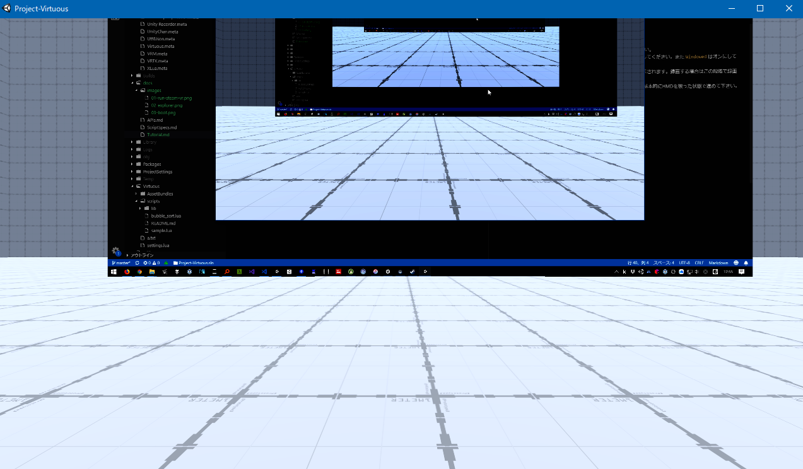
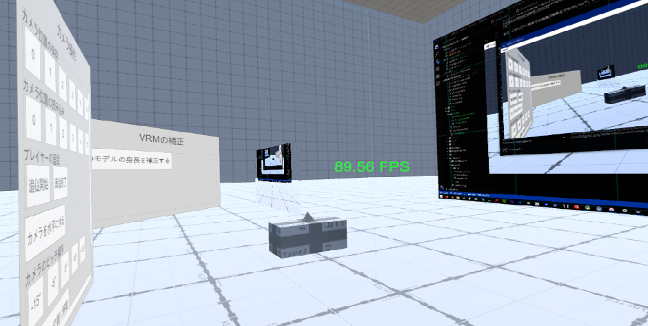
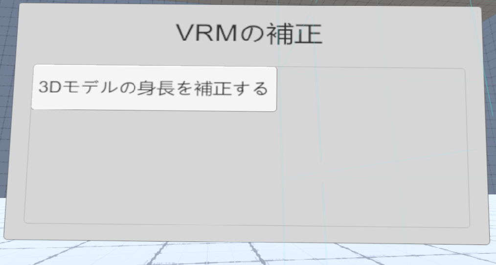
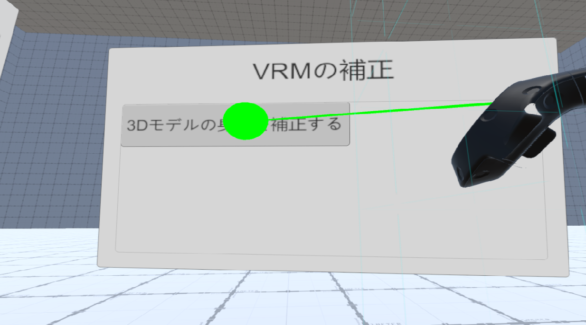
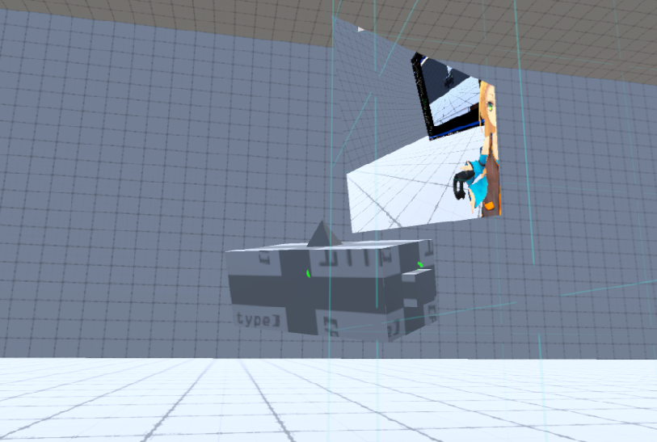
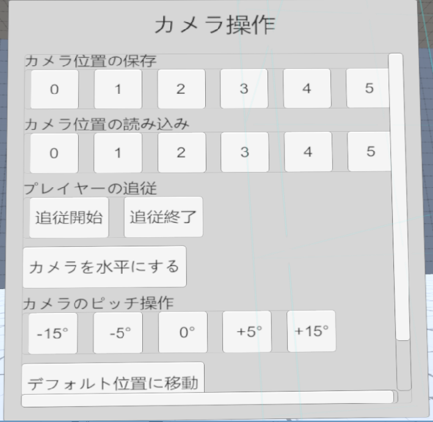
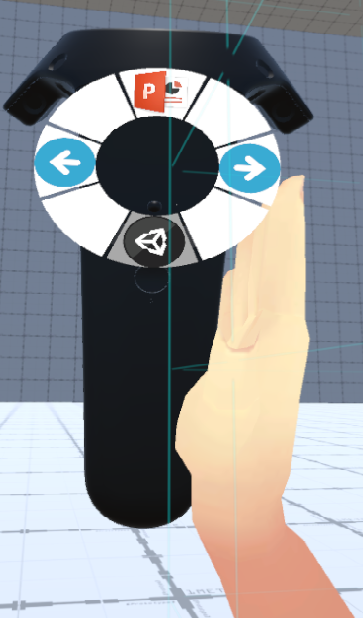

# チュートリアル

Project-Virtuousのチュートリアルです。

## どういうソフト？

Project-VirtuousはVRを用いた **動画教材作成支援ソフト** です。

一般に動画教材というと授業風景をそのまま録画したものや、PowerPointに声を当てて録画したものなどが存在します。

このソフトではVRを用いて仮想空間上に教室を作成し、その中に入って授業をする様子を録画できます。

### このソフトでできること

- VR上の仮想空間に入れる
- 3Dモデルのキャラクターになりきれる
- 仮想空間上のカメラを操作できる
- PowerPointを使ったプレゼンができる
- デスクトップに表示されているものをそのまま仮想空間上に表示できる
- デスクトップを操作できる
- スクリプトを使って動的にオブジェクトを動かしたりできる

このソフト単体での録画・配信などはできないので、別途[OBS Studio](https://obsproject.com/ja)やなんらかのデスクトップキャプチャソフトを利用してください。

また、このソフト単体での映像の編集もできないので、別途[AviUtl](http://spring-fragrance.mints.ne.jp/aviutl/)や[Adobe Premiere Pro](https://www.adobe.com/jp/products/premiere.html)などの映像編集ソフトを利用してください。

## 要件

- HTC Viveでのみテストしています。他のVRシステムはサポートしていません。
- SteamVRは事前にインストールしておいてください
- ボイスの録音をする場合、マイクはソフト起動前にオンにしておいてください。

## 使い方

### 起動まで

1. SteamVRを起動してください。
1. 解凍したフォルダ中の `Project-Virtuous.exe` を起動してください。
1. 起動オプションが表示されます。出力する映像の解像度を選択してください。
    - `Windowed` はオンにしておくと終了しやすくなります。
1. `Play!` を押すとデスクトップ上に撮影用カメラからの映像が表示されます。
    - 録画する場合はこの段階で録画を始めると楽だと思います。  
    
1. HMDを被るとキャラクターからの視点が表示されます。以降は基本的にHMDを被った状態で進めてください。
    - ハンドコントローラーで左右の手を動かすことができます
    - 足は頭の位置によって自動的に移動します。
    

### 仮想空間内での操作

#### 用語の説明

- ポインター
    - 右手コントローラーのトリガーを少し押すことで表示されるレーザーポインターのようなものです。
    - 後述するUIの操作に使います。
- パネル
    - 仮想空間上に浮いている操作盤のことです。
    - 右手コントローラーを近づけると緑に発光し、その状態でグリップを押すと移動させることができます。
    - パネル上でトリガーを引き切るとスクロールさせることができます。
- ボタン
    - パネル上にあるクリックできるボタンです。
    - ポインターで指し示している状態でトリガーを引き切るとクリックできます。
- ディスプレイ
    - 実際のディスプレイと同じ映像を表示しているオブジェクトです。
    - 右手コントローラーを向けるとマウスカーソルの移動ができます。
    - 右手コントローラーのトリガーを引くことでクリックができます。
    - 右手コントローラーのトリガーを引き続けた状態でドラッグができます。

#### 身長の調節

起動してすぐの状態ではキャラクターの身長とあなたの身長が合わないので調節する必要があります。

1. HMDを被って直立してください。
1. その状態で `VRMの補正` というパネルの `3Dモデルの身長を補正する` というボタンをクリックしてください。
    
    - 右手コントローラーのトリガーを引くことでクリックできます。
        
1. この操作によって直立した状態の身長にモデルの身長が合わせられます。

#### カメラの調節

デスクトップに表示されるウィンドウには仮想空間上のカメラからの映像が表示されています。

カメラはこのようなオブジェクトです。

直方体の出っ張りがある方がレンズ側で、三角錐が出ているほうがカメラの上を表しています。

また、カメラの横にはプレビューが常に表示されています。

カメラもパネルと同じようにコントローラーのグリップボタンで移動させることができます。

`カメラ操作` パネルを使うことで詳細な操作ができます。

とりあえずディスプレイの正面においておきましょう。

#### PowerPointの操作

PowerPointの操作を簡単に行うことができます。

あらかじめ表示したいPowerPointを開いておいてください。

1. 右手コントローラーのトラックパッドに指を乗せるとアイコンが出てきます。
    
1. 各アイコンに指が乗った状態でトラックパッドを押すとそのアイコンに対応した動作が行えます。
    - 上のPowerPointのアイコン = 開いているPowerPointのスライドショーの開始
    - 左右の矢印アイコン = スライドの戻る・進む

#### 作成したスクリプトの読み込み

作成したスクリプトを読み込むには `スクリプトの読み込み` パネルから読み込みたいスクリプトをクリックしてください。

スクリプトの作成については [スクリプト仕様](ScriptSpecs.md) を参照してください。

#### 3Dモデルの切り替え

プレイヤーのモデルを変更できます。

詳細は [プレイヤーモデルの仕様](PlayerModelSpecs.md) を参照してください。